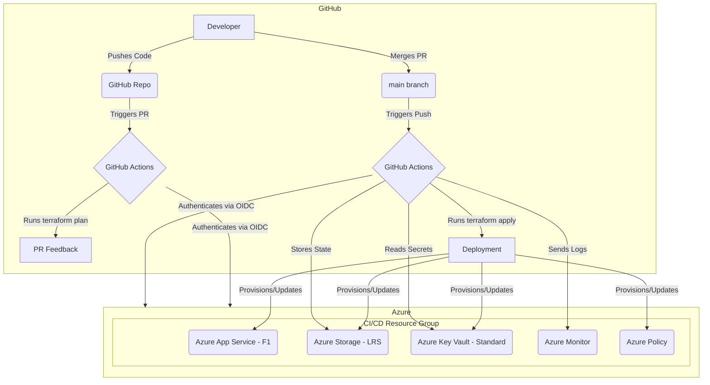

# Azure Enterprise CI/CD MVP - Design

## 1. Overview

This document outlines the design for a simplified, enterprise-grade CI/CD implementation on Azure that operates entirely within the Free Tier. The design prioritizes cost control, security, and automation using Terraform and GitHub Actions.

## 2. Core Components

The architecture is composed of the following core components:

1.  **Source Control & CI/CD Orchestration (GitHub)**
    *   **GitHub Repository**: A central Git repository will host all Terraform infrastructure code and GitHub Actions workflow definitions.
    *   **GitHub Actions**: This is the engine of the CI/CD pipeline, responsible for executing all workflows, including `terraform plan` and `terraform apply`.
    *   **Branch Protection**: The `main` branch will be protected, requiring pull request (PR) reviews to ensure code quality and prevent direct commits.

2.  **Infrastructure as Code (Terraform)**
    *   **Terraform**: The definitive tool for declaratively defining, provisioning, and managing the Azure infrastructure.
    *   **Azure Verified Modules (AVM)**: We will use Microsoft-supported, pre-built Terraform modules to ensure our configurations adhere to best practices and are standardized.
    *   **Remote State Management**: Terraform's state will be stored in an Azure Blob Storage container to ensure state locking and provide a single source of truth for the infrastructure's state.

3.  **Azure Resources (Free Tier)**
    *   **Azure Resource Group**: A dedicated resource group (`rg-cicd-free-tier`) will contain all resources to simplify management and cost tracking.
    *   **Azure Storage Account**: A `Standard_LRS` storage account will be used for two purposes: storing the Terraform remote state and storing build artifacts. A 7-day lifecycle policy will be applied to artifacts to stay within the 5 GB free limit.
    *   **Azure Key Vault**: A standard SKU Key Vault will be used to securely store all secrets, such as service principal credentials or API keys.
    *   **Azure App Service Plan (F1 SKU)**: A Free Tier (F1) Linux App Service Plan will host a simple web app for a pipeline dashboard.
    *   **Azure Web App**: A Linux-based web app deployed to the free plan.
    *   **Azure Monitor**: Used for basic logging of critical pipeline events to stay within the 5 GB/month free ingestion limit.

4.  **Security & Governance**
    *   **OIDC Authentication**: GitHub Actions will authenticate with Azure using OpenID Connect (OIDC), eliminating the need to store long-lived secrets in GitHub.
    *   **Managed Identity**: Azure resources will use managed identities for secure communication with other Azure services where possible.
    *   **Azure Policy**: A custom Azure Policy will be assigned to the resource group to explicitly deny the creation of any resources that use non-free SKUs.

## 3. High-Level Architecture Diagram

## 4. Workflow Design

1.  **Pull Request Workflow (`terraform-plan.yml`)**: 
    *   **Trigger**: A pull request is opened against the `main` branch.
    *   **Actions**:
        1.  Checkout code.
        2.  Log in to Azure using OIDC.
        3.  Initialize Terraform (`terraform init`).
        4.  Validate and format the code (`terraform validate`, `terraform fmt`).
        5.  Generate an execution plan (`terraform plan`).
        6.  Run a cost analysis script to check the plan for non-free SKUs.
        7.  Post the plan's output as a comment on the PR for review.

2.  **Push to Main Workflow (`terraform-apply.yml`)**: 
    *   **Trigger**: The pull request is merged into the `main` branch.
    *   **Actions**:
        1.  Checkout code.
        2.  Log in to Azure using OIDC.
        3.  Initialize Terraform (`terraform init`).
        4.  Apply the configuration (`terraform apply -auto-approve`).
        5.  Extract outputs (e.g., dashboard URL) and store them as artifacts.
